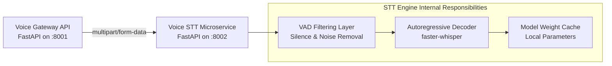
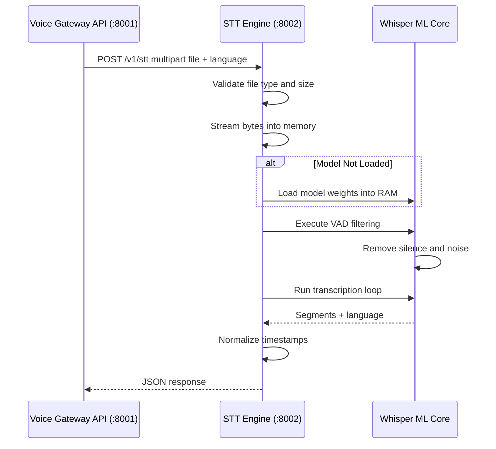

# Voice STT Microservice Engine

A specialized, host-isolated Speech-to-Text (STT) microservice built with FastAPI and Faster-Whisper.

This service performs local machine-learning inference on audio streams and converts speech into structured text responses. It is designed to run as an isolated execution worker behind the Voice Gateway API.

Clients should never call this service directly from public applications. All external traffic should pass through the Voice Gateway, which owns authentication, usage tracking, storage management, and user account state.

---

## Table of Contents

* [Architecture & Boundaries](#architecture--boundaries)
* [How Requests Move Through The System](#how-requests-move-through-the-system)
* [Project Structure](#project-structure)
* [Endpoints](#endpoints)
* [Voice Engine Integration Contract](#voice-engine-integration-contract)
* [Response Schema](#response-schema)
* [Environment Variables](#environment-variables)
* [Local Development Setup](#local-development-setup)
* [Docker Production Setup](#docker-production-setup)
* [Production Optimization Checklist](#production-optimization-checklist)

---

# Architecture & Boundaries



## System Responsibilities

### Voice Gateway API (:8001)

Responsible for:

* User Authentication
* JWT Validation
* API Key Verification
* Usage Accounting
* Database Persistence
* Audio Storage
* Audit Logging
* Request Routing

### STT Engine (:8002)

Responsible for:

* Audio Validation
* Audio Decoding
* Voice Activity Detection
* Faster-Whisper Inference
* Language Detection
* Segment Generation
* Transcript Formatting

The STT engine remains completely stateless.

No user accounts, API keys, or database records are stored inside this service.

---

# How Requests Move Through The System



---

# Project Structure

```text
voice-stt/
├── app/
│
│   ├── main.py
│   ├── config.py
│
│   ├── api/
│   │   └── routes.py
│
│   ├── core/
│   │   └── logging.py
│
│   ├── models/
│   │   └── asr_whisper.py
│
│   └── schemas/
│       └── stt.py
│
├── Dockerfile
├── requirements.txt
└── README.md
```

### Folder Responsibilities

| Folder        | Purpose                                 |
| ------------- | --------------------------------------- |
| app/api       | FastAPI route declarations              |
| app/models    | Whisper wrapper and model lifecycle     |
| app/schemas   | Request/response validation             |
| app/core      | Logging and shared utilities            |
| app/config.py | Environment configuration               |
| app/main.py   | FastAPI startup and router registration |

---

# Endpoints

| Method | Path    | Auth                     | Purpose              |
| ------ | ------- | ------------------------ | -------------------- |
| GET    | /health | None                     | Health Check         |
| POST   | /v1/stt | Private Internal Network | Speech Transcription |

---

## Health Check

### Request

```bash
curl http://localhost:8002/health
```

### Response

```json
{
  "status": "ok"
}
```

---

## Speech To Text

### Request

```bash
curl -X POST http://localhost:8002/v1/stt \
  -F "file=@user_voice_capture.webm;type=audio/webm" \
  -F "language=en"
```

Supported Formats:

* WAV
* MP3
* WEBM
* M4A
* OGG

---

# Example Response

```json
{
  "text": "Hello, welcome to the voice gateway.",
  "language": "en",
  "segments": [
    {
      "start": 0.0,
      "end": 2.4,
      "text": "Hello, welcome"
    },
    {
      "start": 2.4,
      "end": 4.6,
      "text": "to the voice gateway."
    }
  ]
}
```

---

# Voice Engine Integration Contract

The Voice Gateway forwards requests to the STT engine using multipart form-data.

The STT engine accepts:

```text
file
language (optional)
```

The STT engine returns:

```text
text
language
segments
```

No additional fields should be introduced without updating the Gateway integration layer.

---

# Response Schema

```python
from pydantic import BaseModel
from typing import List

class STTSegment(BaseModel):
    start: float
    end: float
    text: str


class STTResponse(BaseModel):
    text: str
    language: str
    segments: List[STTSegment]
```

---

# Faster-Whisper Configuration

Recommended production settings:

```python
WhisperModel(
    "large-v3",
    device="auto",
    compute_type="float16"
)
```

Transcription:

```python
segments, info = model.transcribe(
    audio,
    beam_size=5,
    vad_filter=True
)
```

Recommended:

| Setting      | Value    |
| ------------ | -------- |
| Model        | large-v3 |
| Beam Size    | 5        |
| VAD Filter   | True     |
| Compute Type | float16  |
| Device       | auto     |

---

# Environment Variables

| Variable        | Example               | Purpose                 |
| --------------- | --------------------- | ----------------------- |
| MODEL_NAME      | large-v3              | Whisper model selection |
| HOST            | 0.0.0.0               | Bind address            |
| PORT            | 8002                  | Service port            |
| LOG_LEVEL       | INFO                  | Logging level           |
| VAD_FILTER      | true                  | Enable silence removal  |
| BEAM_SIZE       | 5                     | Transcription quality   |
| MAX_AUDIO_MB    | 25                    | Upload limit            |
| ALLOWED_ORIGINS | http://localhost:3000 | CORS origins            |

Example:

```env
MODEL_NAME=large-v3
HOST=0.0.0.0
PORT=8002
LOG_LEVEL=INFO
VAD_FILTER=true
BEAM_SIZE=5
MAX_AUDIO_MB=25
```

---

# Local Development Setup

Create environment:

```bash
python -m venv .venv
```

Activate:

### Windows

```powershell
.\.venv\Scripts\Activate.ps1
```

### Linux / macOS

```bash
source .venv/bin/activate
```

Install dependencies:

```bash
pip install --upgrade pip setuptools wheel
pip install -r requirements.txt
```

Run locally:

```bash
uvicorn app.main:app \
    --host 0.0.0.0 \
    --port 8002 \
    --reload
```

Open:

```text
http://localhost:8002/docs
```

---

# Docker Production Setup

## Dockerfile

```dockerfile
FROM python:3.11-slim

RUN apt-get update && apt-get install -y --no-install-recommends \
    ffmpeg \
    && apt-get clean \
    && rm -rf /var/lib/apt/lists/*

WORKDIR /code

COPY ./requirements.txt /code/requirements.txt

RUN pip install --no-cache-dir --upgrade pip setuptools wheel \
    && pip install --no-cache-dir -r /code/requirements.txt

COPY . /code/

CMD uvicorn app.main:app \
    --host 0.0.0.0 \
    --port ${PORT:-8002}
```

---

## Build

```bash
docker build -t voice-stt .
```

---

## Run

```bash
docker run -p 8002:8002 voice-stt
```

---

# Integration With Voice Gateway

Gateway Configuration:

```env
STT_ENGINE_URL=http://localhost:8002
STT_ENGINE_PATH=/v1/stt
```

Gateway Request:

```text
POST /speech-to-text
```

Gateway forwards:

```text
multipart/form-data

file
language
```

Gateway receives:

```json
{
  "text": "...",
  "language": "...",
  "segments": [...]
}
```

and stores usage metrics, audit logs, and uploaded file references.

---

# Production Optimization Checklist

Before deployment verify:

* [ ] STT_ENGINE_URL points to the correct service.
* [ ] Faster-Whisper model loads successfully.
* [ ] VAD filtering is enabled.
* [ ] Beam size is configured correctly.
* [ ] Upload limits are enforced.
* [ ] CORS origins are restricted.
* [ ] Engine remains stateless.
* [ ] Audio is processed entirely in memory.
* [ ] Health endpoint returns status ok.
* [ ] Docker image builds successfully.
* [ ] Gateway integration tested end-to-end.
* [ ] Logs collected by deployment platform.
* [ ] Model weights cached locally after first run.

---

# Performance Notes

Typical pipeline:

```text
Audio Upload
      │
      ▼
Validation
      │
      ▼
VAD Filtering
      │
      ▼
Faster-Whisper
      │
      ▼
Language Detection
      │
      ▼
Segment Formatting
      │
      ▼
JSON Response
```

The service is optimized for local execution on CPU or GPU and is designed to scale horizontally behind a private API gateway.

---

# License

MIT License

---

# Team

Voice Infrastructure Team

Built with FastAPI, Faster-Whisper, FFmpeg, and Python.
